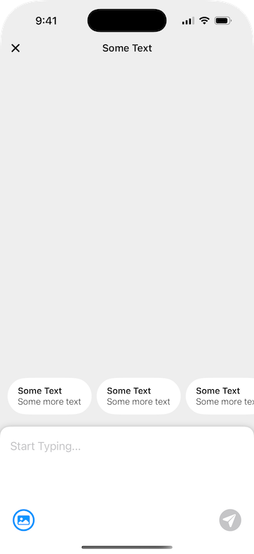
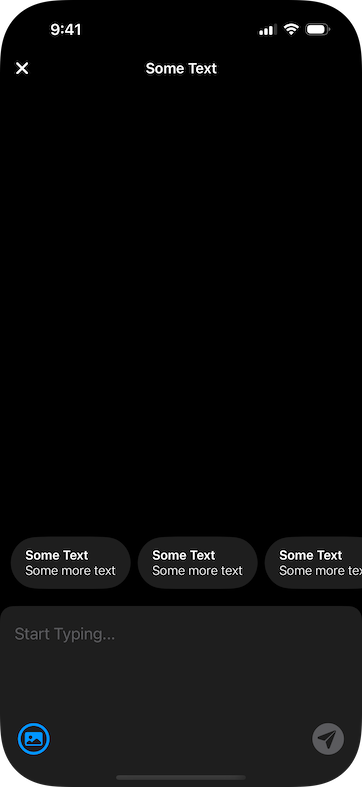

# Design Engineer Assignment

This is a technical assessment for the Design Engineer position at Hatch Innovation.

> ⚠️ **Note:** This project is not intended for production use. Exercise caution if adapting any part of it for production environments.

## Screenshots

| Light Mode | Dark Mode |
|------------|-----------|
|  |  |

## Requirements

- **Minimum iOS Deployment Target:** iOS 17.0  
- **Recommended Xcode Version:** 16.3 or later  
- **Device:** Best experienced on a physical device (for full feature support such as haptic feedback)  
- **Third-Party Framework:** [`SwiftUI-Introspect`](https://github.com/siteline/SwiftUI-Introspect)

## Features

- Dynamic font scaling with scrollable `TextEditor`  
- Expandable `TextEditor` with animated background dimming and scaling (mimicking iOS sheet presentation)  
- Send button highlights with a glow effect when active  
- Keyboard dismissal via drag gesture  
- Seamless interactive keyboard dismissal integrated with `ScrollView`  
- Semi-expanded photo picker on tapping the photo icon  
- Drag gestures for expanding and collapsing the photo picker  
- Thumbnail previews for selected images  
- Smooth, fine-tuned animations for all interactions and transitions  
- Modular architecture implemented via Swift Package

## Accessibility

- Full support for Dark Mode  
- Accessibility labels and hints provided for all interactive UI elements